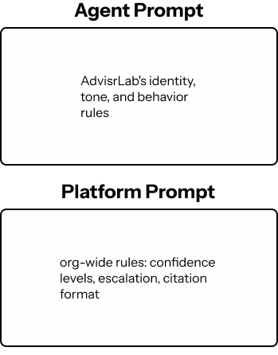
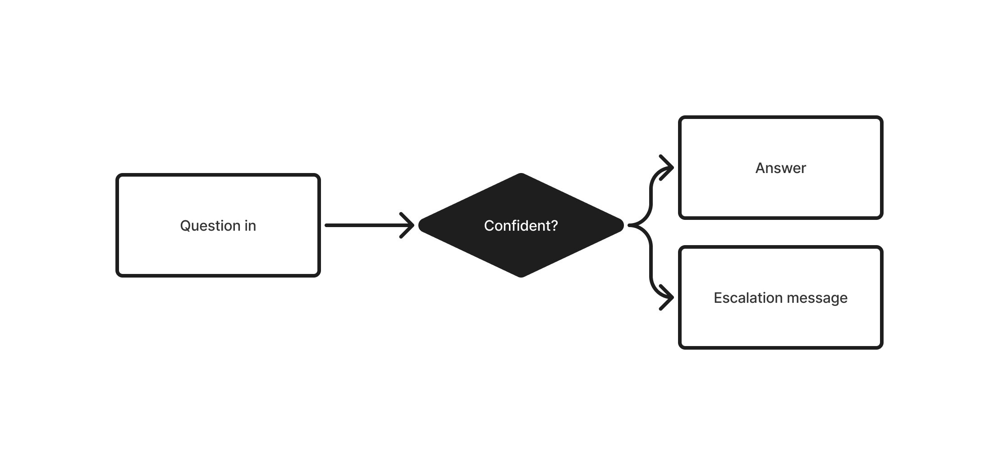

## A wrong answer costs a quarter

Scenario: Registration week. A student asks whether they can skip a prerequisite. The assistant says yes, confidently, in clean sentences.

It's wrong. The student registers, finds out in week two, and loses a quarter.

That failure was the reason this project was hard. Not the answering — the knowing when not to.

**I led a team of 5 building an AI advising assistant for Informatics students on the UW’s Purple AI platform.** I ran the research, designed the prompt architecture, and set the roadmap.

## What we learned from students initially

### Wait time wasn’t the problem

We surveyed 29 students *expecting* to hear that advising was too slow.

**Only 15%** said wait time was their biggest problem.

The real complaint was that the answers didn't agree with each other — **31%** said information was scattered across too many sites, and **19%** said they'd gotten conflicting answers from different sources. Half the respondents had an information-trust problem, not a speed problem.

### Students already had AI. It wasn't working.

**83%** of students had used AI for academic questions — a third of them often or always.

But only **32%** said it gave them an effective answer. The most common response was "sometimes."

So the gap wasn't access to AI. Students had that. The gap was an AI whose answers they could act on.

**We weren't building something smarter. We were building something students could check.**

### What students said would earn their trust

We asked directly. The answers pointed straight at two features:

* **71%** — direct links to official iSchool sources  
* **63%** — the ability to escalate to a human when the bot fails  
* **50%** — the bot admitting when it doesn't know

An "approved by advisors" badge came last at 46%. Students didn't want to be told the tool was credible. They wanted to verify it themselves.

### The finding that changed what we were building

**46%** of students said they often or always avoided asking an advising question — not because they couldn't reach an advisor, but because they felt embarrassed the question was stupid.

Those questions never reached the system at all. They didn't show up as long wait times or unanswered emails. They just went unasked.

**35%** told us they'd use an AI specifically to ask without feeling judged.

**The assistant doesn’t only cover nights and weekends. It also covers the questions students wouldn't ask a person.**

That set the bar for tone. An assistant that answered basic questions briskly, or made a student feel handled, would fail at the exact moment it mattered most.

## Decisions

**Citations on every factual claim.** The top trust factor, and the direct fix for conflicting information. If two sources disagreed, the assistant linked the official one rather than picking a winner silently.

**Two prompt layers, not one.** Advising facts in one, voice in the other. A single prompt makes them fight — every tone fix risks breaking a fact. Split, the team could update policy without retesting how it talked.

**Escalate on low confidence.** 63% named this as a trust factor, but drawing the line was the hardest call on the project. Escalate too often and it's a glorified FAQ. Too rarely and a student registers on a wrong answer and loses a quarter. .

## What happened

Six user testing sessions produced four failure modes, each with a matching design requirement. That list became the build spec.

**Citations were the only feature students named unprompted in both rounds.** 71% of survey respondents ranked them the top trust factor, and 5 of 7 testers brought them up without being asked. That consistency is why citations became a hard requirement rather than a nice-to-have.

**Testers described the escalation system before we built it.** Asked what would improve the tool, they named a confidence score, a refusal to answer when unsure, and a booking link back to an advisor — the three components of the handoff design.

The project shipped as a specification, not a product: prompt architecture, escalation logic, and handoff documentation for the team taking it forward. Presented to iSchool’s IT team.

## What I'd change

Six usability participants is enough to find problems, not enough to rank them. The self-correction failure showed up once, clearly — I'd want to know whether it happens on every challenge or only on low-confidence answers before designing the fix.

---

*The full survey instrument, interview script, and testing findings — happy to walk through them.*

