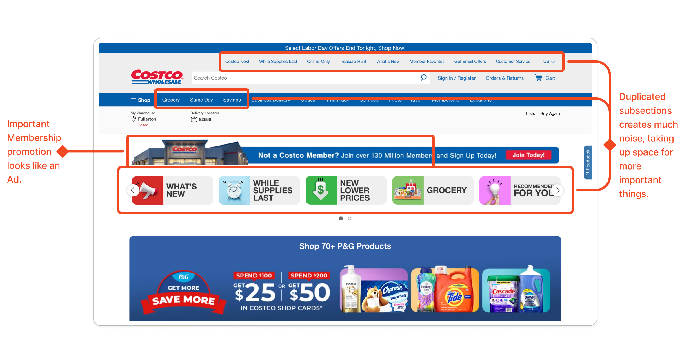
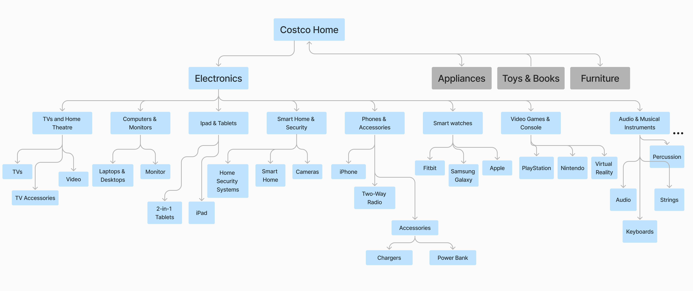
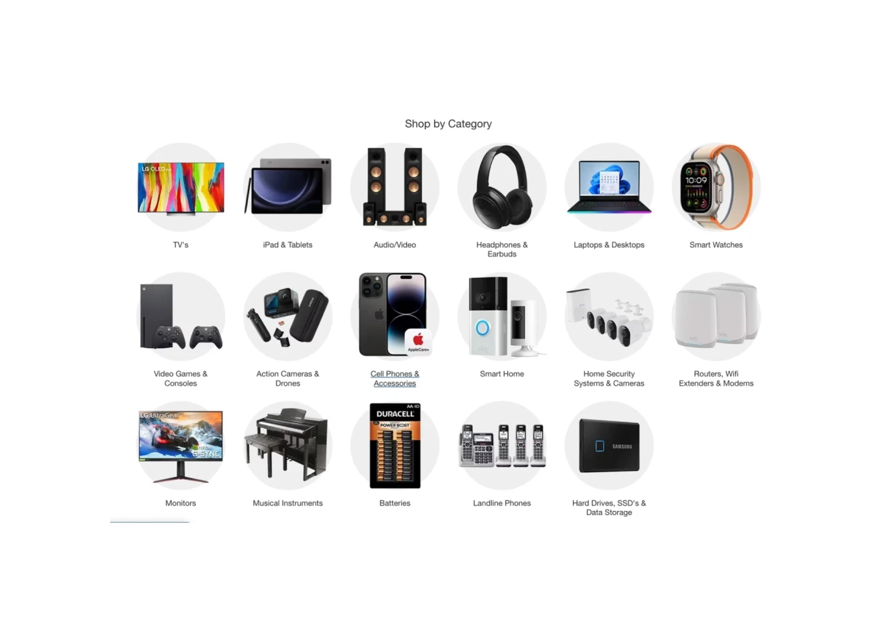
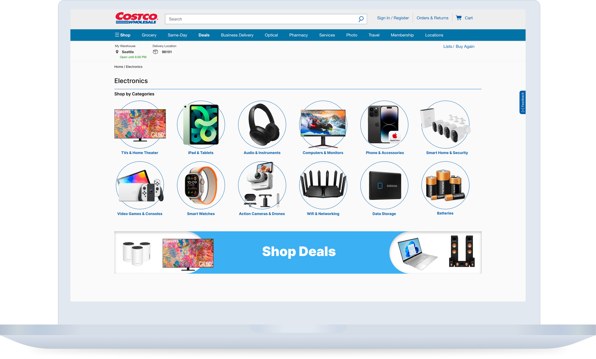
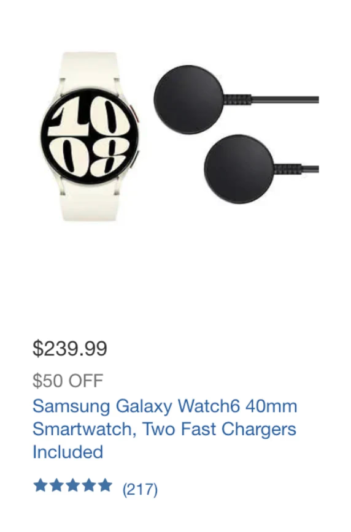
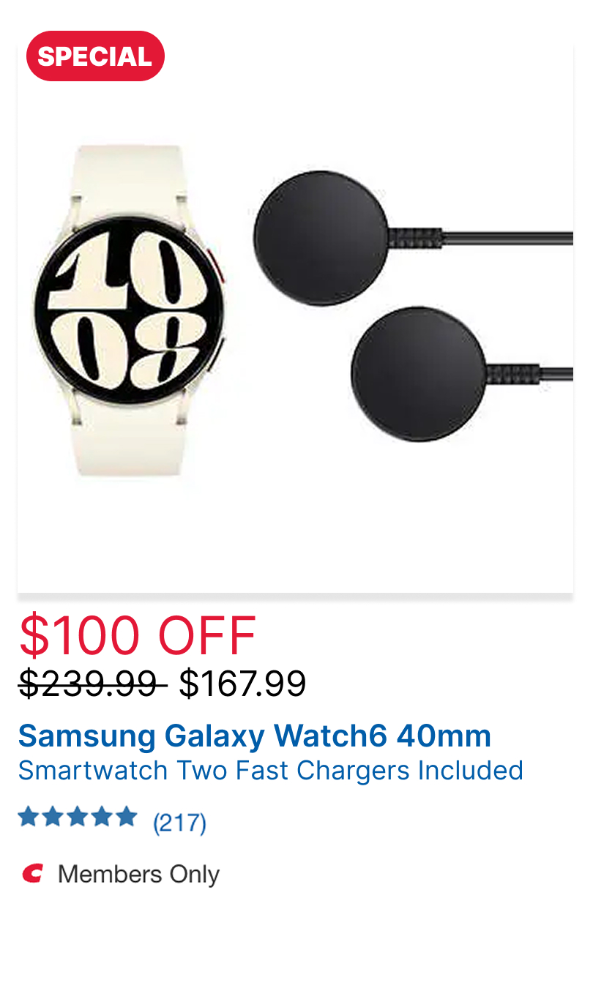
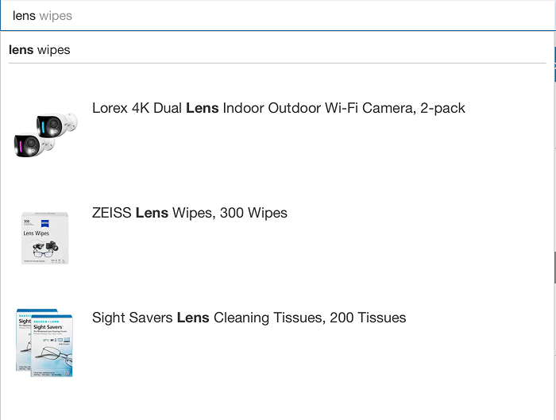
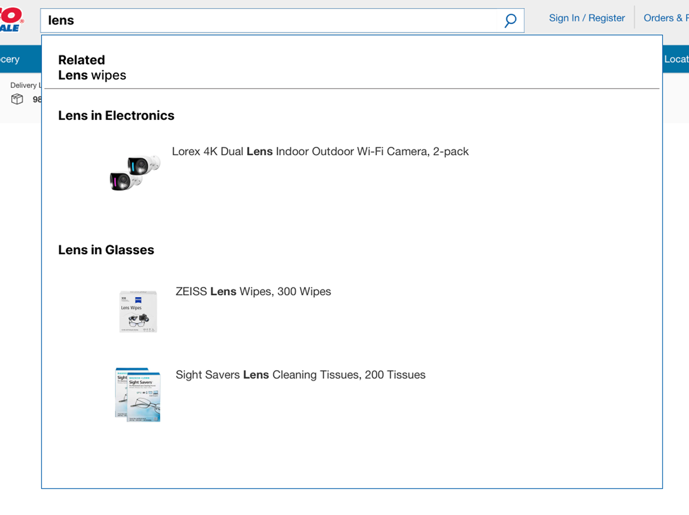

## A page competing with itself

Costco is one of the largest retailers in the world. Most people know it for the warehouses: bulk goods, low prices, a membership card at the door.

The website does the same job online. The Electronics section sells TVs, laptops, headphones, and accessories, alongside promotions and membership offers, all on one page.

We spent weeks on that page.

The first thing we noticed had nothing to do with categories. Costco's own products looked like ads. The product carousel used the same shapes as an ad unit. The membership banner sat beside it looking much the same. Real products, in the format people have learned to skip.

Underneath that, 17 categories overlapped each other across menus that repeated the same options.

Nothing on the page was broken. It was just competing with itself for attention.

## What we were solving

Costco's Electronics page had two problems stacked on each other: promotional visual patterns that triggered banner blindness, and a fragmented information architecture underneath them.

Four of us, ten weeks, one section. Streamline navigation, labeling, and search, and produce something the rest of the site could inherit.

I'm a psychology major as well as an informatics one, so I came at this as a cognitive load problem rather than a visual one. The page didn't look bad, but asked too much of the person reading it.

## What we changed

### Cut 17 categories to 12

We defined a controlled vocabulary. One agreed label per concept, then
cross-referenced it against Sam's Club's electronics taxonomy. Their
structure gave us a working benchmark for what a comparable retailer
treats as a real category, so the cuts came from comparison rather than
opinion.

Five categories came out: duplicates under different names, items filed
under the wrong parent, and slices too narrow for anyone to browse by.

Further justified by psychological principals.

> **🧠 Hick's Law** — decision time grows with the number and complexity of
> choices. The overlap was the real cost: users had to rule options out
> before they could rule one in.

> **🧠 Miller's Law** — people hold about seven items in working memory.
> Seventeen isn't a list anymore, it's a wall.

**We unified "Shop by Category' with new icons**

> **🧠 Miller's Law again** — chunking. Twelve icons in a grid read as one
> group. Twelve text links in a column read as twelve decisions.

<figure>
<figcaption>Before</figcaption>

</figure>
<figure>
<figcaption>After</figcaption>

</figure>

### Reordered product cards

The primary action and the key differentiators moved up. A card should
answer "is this the one?" before it answers anything else.

<figure>
<figcaption>Before</figcaption>

</figure>
<figure>
<figcaption>After</figcaption>

</figure>

### Grouped search suggestions by category

Suggestions arrive pre-sorted instead of as a flat list.

> **🧠 Gestalt proximity** — things placed near each other read as one
> group. Grouping does the filtering, so the user doesn't have to.

<figure>
<figcaption>Before</figcaption>

</figure>
<figure>
<figcaption>After</figcaption>

</figure>

## Result

A restructured Electronics section: 12 categories instead of 17, one
navigation system instead of several, and search that groups before the
user has to.

Project constraints kept us from a full site-wide high-fidelity
prototype, so we treated Electronics as a blueprint — the taxonomy
method and the card hierarchy transfer to any other department.

<!-- FILL: this is the section that needs the most work. Anything you can
measure helps — time-on-task from a walkthrough, click depth to reach a
product before and after, even a count of steps removed. If you have
nothing, say what the deliverable was and who received it. -->

## What I'd change

We designed against principles and a competitor, not against people.
Hick's Law tells you 17 is too many. Sam's Club tells you what a
comparable retailer settled on. Neither tells you which 12 are right for
Costco's shoppers — that needs card sorting, and we didn't have it.

<!-- FILL: confirm — if you did any card sorting or testing, this section
changes completely and should say so. -->

The other thing I'd pursue: connecting online browsing to in-store
inventory. Costco's real advantage is the warehouse down the road, and
the website behaves as if it doesn't exist.

---

_Happy to walk through the full site map and the categories that didn't
survive._
