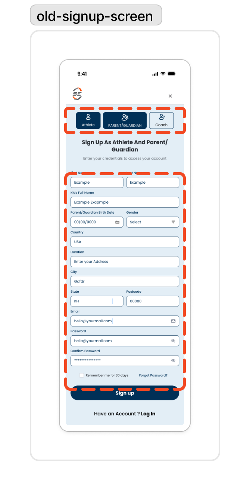
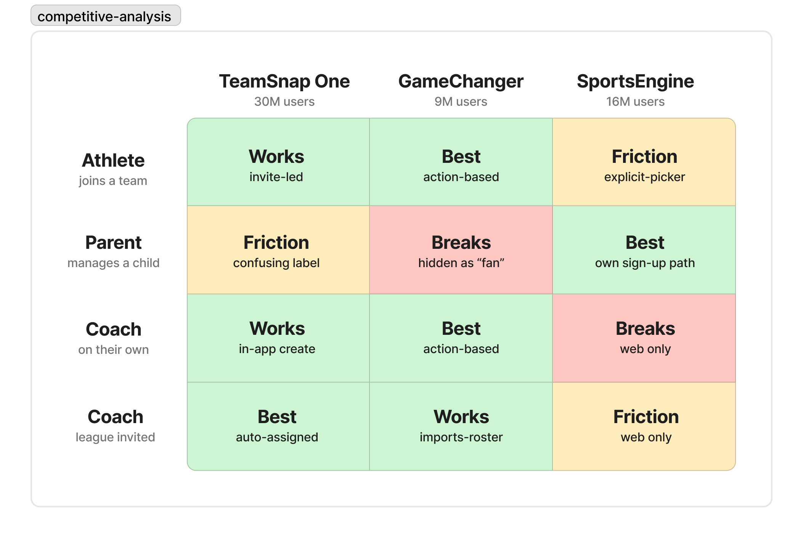
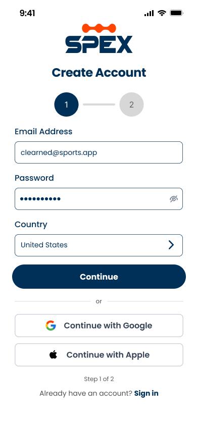
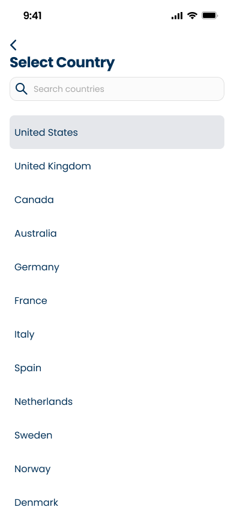
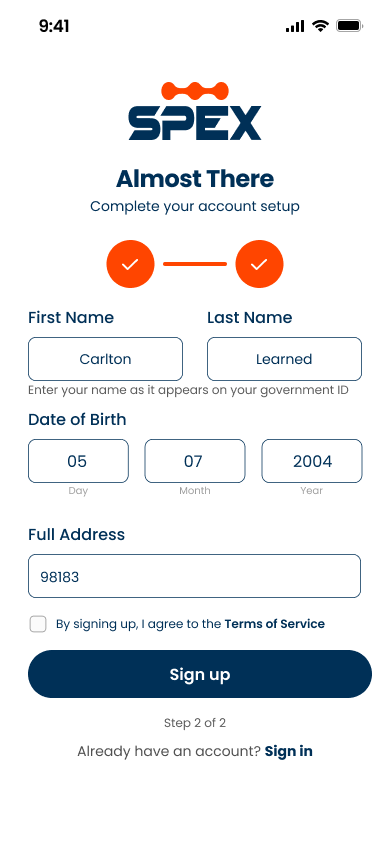
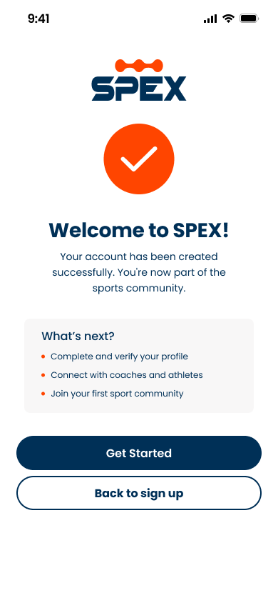
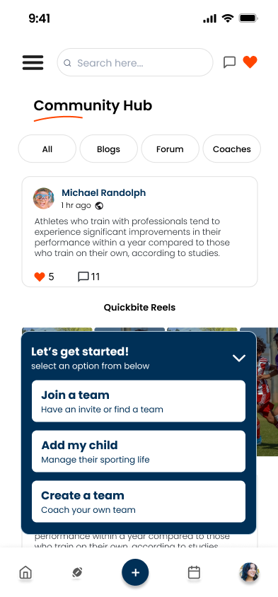
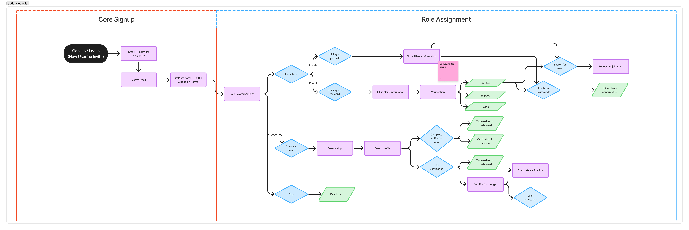

## The more involved you were, the worse sign-up got

Scenario: A mom plays rec league, coaches her daughter's team, and follows her
games. She's three users at once.

The old sign-up form let her say so. Athlete, parent, coach — all three
selectable.

Then it gave her all three sets of fields. The more role you are, the
longer your sign-up process is, before you'd seen anything the app does.

## The product

SportsExcitement is a community sports platform for youth and adult
leagues. Team management, schedules, player tracking, a gear store, and
a social feed. Parents and coaches organize; athletes play; everyone
connects.

I was the UX design intern. My task was the redesigning the onboarding
flow.

## We studied three competitors

I ran a competitive analysis with the UX researcher on the team. We
tested TeamSnap One (30M users), GameChanger (9M), and SportsEngine
(16M). Chosen for scale, and variety: each one handles roles differently.

We mapped four pathways through each app:

- **Athlete** joining a team
- **Parent** managing a child's participation
- **Coach** creating a team on their own
- **Coach** invited by a league admin

**Three findings mattered.**

**1. Action-based role assignment already works.** GameChanger doesn't
ask "are you a coach or an athlete?" It shows "Find an existing team"
and "Create new." The role comes from the tap. Lowest friction of the
three, and proof the pattern isn't theoretical.

**2. Every competitor underserves parents.** GameChanger files them
under "Fan" with limited access. TeamSnap calls them "Non-player."
SportsEngine handles them best but still treats them as secondary.
Parents are the ones paying and organizing, and all three apps treat
them as an afterthought.

## The design

**Cut sign-up to the minimum.** Email, password, country, first and last
name, date of birth, zip code, and terms. Seven fields, split across two
screens so neither one feels long.

**Added email verification.** Account security, and it matches what all
three competitors do.

**Moved role assignment to the home screen.** A "Let's get started"
menu with three options:

| What they tap | What they become |
| ------------- | ---------------- |
| Join a team   | Athlete          |
| Add my child  | Parent           |
| Create a team | Coach            |

<figure class="media-portrait">
  <video
    controls
    preload="metadata"
    playsinline
    width="696"
    height="1400"
    aria-label="Screen recording of the Let's get started menu on the SportsExcitement home screen, offering Join a team, Add my child, and Create a team."
  >
    <source src="/video/action-menu.mp4" type="video/mp4" />
    Your browser cannot play this video.
  </video>
  <figcaption>Roles assign from the first action, not from a form field.</figcaption>
</figure>

**The parent option is the part that isn't copied.** GameChanger proved
action-based assignment works, but it only offers two paths: find a
team or create one. A parent has to pick the athlete path and then
correct it later. Adding "Add my child" as a first-class option is the
direct fix for the gap we found in all three apps.

## The sign-up screens

Left to right, the order a new user meets them.

## The full user flow

Sign-up is the short part. The flow that carries the design is what
happens after it.

The old flow mixes up all of the role assignment, making the form longer; the new user floe allows users to get into the app faster, then triggers needs based on their action.

**Three branches + an exit.** Join a team, create a team, or skip.
Skip goes straight to the dashboard, so a user can look around before
committing to anything. Roles stay unassigned until an action assigns
one.

**Joining splits by who it's for.** "Joining for yourself" makes you an
athlete. "Joining for my child" makes you a parent. A parent never has to sign up as an athlete and correct it later, which is exactly the failure I found in GameChanger.

**Coaches can create a team before verifying.** Verification is
skippable, and a nudge brings them back later. Blocking team creation on
a background check would stall the one action a coach came to do.

## Working with AI

I used Claude and Figma Make to move fast, including copy
variants, edge cases I'd have missed alone. Figma Make turned an idea
into a screen in minutes.

The screens looked finished but couldn't justify themselves. Clean
layout had no answer to why any of it was that way.

So I split the work. AI for breadth, the reasoning stayed mine.

## What shipped

**Sign-up went from 15+ fields to 7, across two screens.**

I handed off the final design to the design team and the development team, documenting edge cases and haptics. The feature is still in implementation and user testing phase before my internship ended. New designers picked up my work and continued designing user verification screens.

---

_Happy to walk through the full design process that didn't make it._
